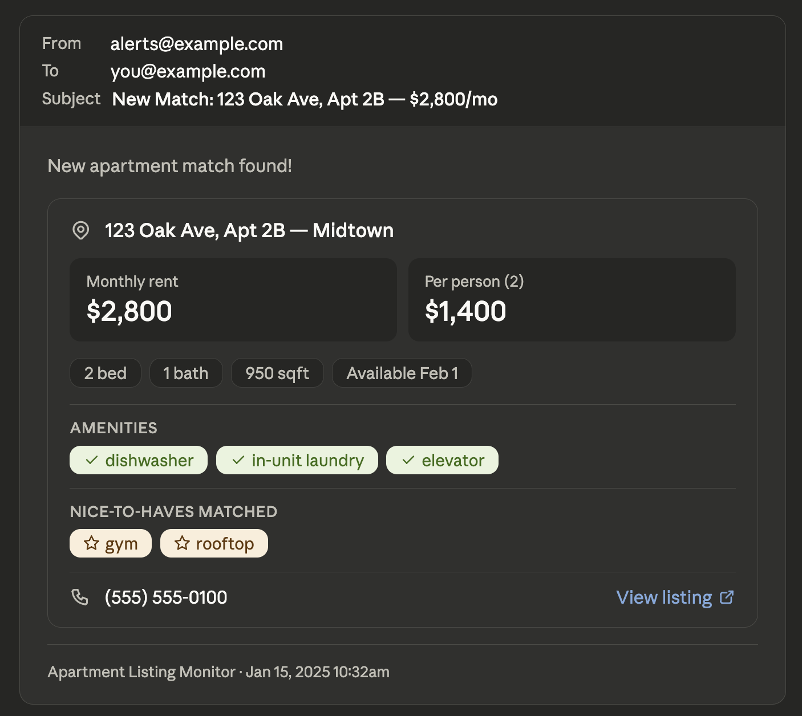

# Apartment Listing Monitor

A config-driven Cowork plugin that checks apartment listing URLs on a schedule, tracks seen vs. new listings in a local JSON state file, and fires notifications (email, SMS, Slack) when new matches are found under your price threshold.

No coding required. Set it up in Cowork, point it at your listing searches, and let it run.

---

## What this is / what this is not

**This is** a set of Claude AI skill instructions packaged as a Cowork plugin. When you trigger a skill (e.g. "check listings"), Claude reads your config, fetches your listing URLs, and follows the skill's instructions to filter, track, and notify. There is no compiled code, no server, no scraper binary, and no dependencies to install.

**This is not** a standalone script or app you can run from the command line. It requires [Claude Cowork](https://claude.ai) and at least one connected notification tool (email, SMS, or chat). It also is not guaranteed to work on every listing site — sites that require JavaScript or a login to display results may not be readable by the fetcher.

---

## Known limitations

- **JS-rendered sites**: Many large property management sites (e.g. Irvine Company, Equity Residential) require JavaScript to display availability. Claude's web fetch tool cannot execute JavaScript. The plugin will fall back to the Claude in Chrome browser tool if available, but results on these sites may be incomplete or empty.
- **Login-gated sites**: Sites that require you to be logged in (e.g. some Facebook Marketplace views) cannot be accessed by the monitor.
- **Parsing fragility**: Listing sites change their HTML structure without notice. If a site stops returning listings, verify the URL still works manually and file an issue.
- **No deduplication across sources**: If the same listing appears on multiple sites, you may receive multiple alerts for it.

---

## How it works

1. You give it a list of apartment search URLs (Craigslist, Zillow, Apartments.com, etc.)
2. Every hour (or on whatever schedule you set), it fetches each page and parses the listings
3. New listings are filtered against your criteria: price ceiling, bed/bath count, neighborhood, must-have amenities, and dealbreakers
4. Matches trigger instant email (and optional SMS/Slack) alerts with price-per-person, amenities, phone number, and a direct link
5. A daily digest and weekly recap roll up everything in one summary

All state is stored locally in `seen-listings.json` — no external database needed.

---

## Skills

| Skill | Trigger phrases | What it does |
|---|---|---|
| `check-listings` | "check listings", "scan for new apartments", "any new units?" | Full scan: fetch, filter, notify |
| `configure` | "configure", "set up my search", "first time setup" | Interactive config.yaml wizard |
| `daily-digest` | "send daily digest", "morning summary" | Compiled digest of past 24h matches |
| `weekly-recap` | "send weekly recap", "weekly summary" | Broader search + full week summary |
| `schedule-setup` | "set up my schedule", "automate the monitor" | Creates the three Cowork scheduled tasks |

---

## Quick Start

### 1. Install the plugin

Download `apartment-listing-monitor.plugin` from the [Releases page](https://github.com/leeshyan/apartment-listing-monitor/releases) and drag it into Cowork.

### 2. Connect your notification tools

In Cowork Settings → Connectors, add at least one of:
- An email connector (Gmail, Resend, etc.)
- An SMS connector (Twilio) — optional
- A chat connector (Slack, Teams) — optional

See [CONNECTORS.md](CONNECTORS.md) for details.

### 3. Run setup

In Cowork, type:

> **configure**

This walks you through creating your `config.yaml`. It takes about 2 minutes.

### 4. Test your config

> **check listings**

Runs a one-time scan so you can see what it finds before automating.

### 5. Set up the schedule

> **set up my schedule**

Creates three Cowork scheduled tasks:
- **Instant alerts** — checks every 60 minutes, emails immediately on new match
- **Daily digest** — 8am email with all new matches from the past 24 hours
- **Weekly recap** — Sunday morning email with broader search + market summary

---

## Configuration

Copy `config.example.yaml` to `config.yaml` and fill in your details. Key settings:

```yaml
listing_urls:
  - https://craigslist.org/search/apa?...   # Your search URLs

filters:
  beds_min: 2
  max_price: 3500
  num_people: 2                             # For price-per-person calculation
  must_have: [dishwasher, in-unit laundry]
  dealbreakers: [no pets, street parking only]

notifications:
  email:
    enabled: true
    to: you@example.com
```

Full schema: [skills/configure/references/config-schema.md](skills/configure/references/config-schema.md)

---

## State file

`seen-listings.json` tracks every listing the monitor has seen. It's automatically created on first run and updated after each scan. It's gitignored by default since it can grow large and contains location-specific data.

See `seen-listings.json.example` for the format.

---

## Listing sites

The monitor is designed to work with any site that returns readable HTML. It works most reliably with:

- **Craigslist** — housing search results (static HTML, works well)
- **Zillow** — rental listings (structured data embedded in page)
- **Apartments.com** — search result pages
- **HotPads** — search results
- **Trulia** — rental listings
- **Facebook Marketplace** — housing listings (may require login; results vary)

Sites that rely heavily on JavaScript to render listings (common on large property management company sites) may return empty results without the Claude in Chrome browser tool connected. See Known limitations above.

## Sample alert

Here's what an instant alert email looks like when a match is found:



```
New apartment match found!

📍 123 Oak Ave, Apt 2B — Midtown
💰 $2,800/mo  ($1,400/person · 2 people)
🛏  2 bed · 🚿 1 bath · 950 sqft
📅 Available: Feb 1
📞 (555) 555-0100
🔗 https://example-site.com/listing/abc123

✅ AMENITIES FOUND
• dishwasher
• in-unit laundry
• elevator

⭐ NICE-TO-HAVES MATCHED
• gym
• rooftop

📝 LISTING NOTES
Newly renovated 2BR in the heart of Midtown. Hardwood floors throughout,
exposed brick, large windows…

---
Apartment Listing Monitor | 2025-01-15 10:32am
```

---

## Connectors

See [CONNECTORS.md](CONNECTORS.md) for the full list of supported email, SMS, and chat connectors.

---

## Contributing

Pull requests welcome. To add support for a new listing site, update `skills/check-listings/references/filter-logic.md` with the site's HTML structure and submit a PR.

---

## License

MIT
